# Automating Model Training and Delivery from Amazon SageMaker AI to Amazon EKS

## An end-to-end walkthrough of model tuning, evaluation, explainability, registration, and approval-driven Kubernetes deployment.

This project demonstrates how MLOps and DevOps practices work together to deliver a trained machine learning model into production. Read the accompanying blog post, [Automating Model Training and Delivery from Amazon SageMaker AI to Amazon EKS](https://garystafford.medium.com/automating-model-training-and-delivery-from-amazon-sagemaker-ai-to-amazon-eks-4bf6e48b9f01?sharedUserId=garystafford), for more information.

The MLOps workflow uses [Amazon SageMaker AI Pipelines](https://docs.aws.amazon.com/sagemaker/latest/dg/pipelines.html) to prepare data, tune an XGBoost regression model with [SageMaker Automatic Model Tuning](https://docs.aws.amazon.com/sagemaker/latest/dg/automatic-model-tuning.html), evaluate the best candidate, explain the promoted model with [SageMaker Clarify](https://docs.aws.amazon.com/sagemaker/latest/dg/clarify-model-explainability.html), track the promoted result in [SageMaker managed MLflow Experiments](https://docs.aws.amazon.com/sagemaker/latest/dg/mlflow.html), and register it in [Amazon SageMaker AI Model Registry](https://docs.aws.amazon.com/sagemaker/latest/dg/model-registry.html). After the model is approved, the DevOps workflow uses [AWS CodeBuild](https://docs.aws.amazon.com/codebuild/) and [Amazon Elastic Container Registry (Amazon ECR)](https://docs.aws.amazon.com/ecr/) to package and deploy the model-serving application to [Amazon Elastic Kubernetes Service (EKS)](https://docs.aws.amazon.com/eks/). [Amazon EventBridge](https://docs.aws.amazon.com/eventbridge/) connects the two workflows, creating a continuous path from model approval to Kubernetes deployment.

## Dataset

The sample Abalone dataset for this project can be found on [Kaggle](https://www.kaggle.com/datasets/rodolfomendes/abalone-dataset). The Abalone dataset is a classic tabular dataset used primarily for regression. In ML, XGBoost is a standard benchmark for predicting the age of abalones based on eight easily obtainable physical measurements.

## Files

| File                                      | Purpose                                                                                              |
| ----------------------------------------- | ---------------------------------------------------------------------------------------------------- |
| `pipeline.py`                             | SageMaker SDK v3 pipeline definition and CLI entrypoint.                                             |
| `PIPELINE.md`                             | Detailed walkthrough of `pipeline.py` and its SageMaker Pipeline steps.                              |
| `code/preprocess.py`                      | Processing script that prepares train/validation/test data splits.                                   |
| `code/evaluate.py`                        | Processing script that evaluates the best HPO XGBoost model.                                         |
| `code/run_clarify.py`                     | Processing script that launches SageMaker Clarify SHAP explainability for the best model.            |
| `code/log_experiment.py`                  | Processing script that records the promoted model summary in MLflow/S3 and classic Experiments APIs. |
| `code/register_model.py`                  | Processing script that registers the model package in SageMaker.                                     |
| `app.py`                                  | FastAPI inference service loaded into the Docker image.                                              |
| `Dockerfile`                              | Builds the inference container.                                                                      |
| `buildspec.yml`                           | CodeBuild recipe. CodeBuild reads this every deployment run.                                         |
| `deployment.yaml.tpl`                     | Kubernetes deployment/service template rendered by CodeBuild.                                        |
| `codebuild-trust-policy.json`             | IAM trust policy for the CodeBuild service role.                                                     |
| `codebuild-service-policy.json`           | IAM permissions policy for CodeBuild.                                                                |
| `eventbridge-codebuild-trust-policy.json` | IAM trust policy for EventBridge to start CodeBuild.                                                 |
| `eventbridge-rule.json`                   | EventBridge rule pattern for approved SageMaker model packages.                                      |
| `abalone.csv`                             | Local copy of the sample dataset. Pipeline input should use the S3 copy.                             |

## Architecture

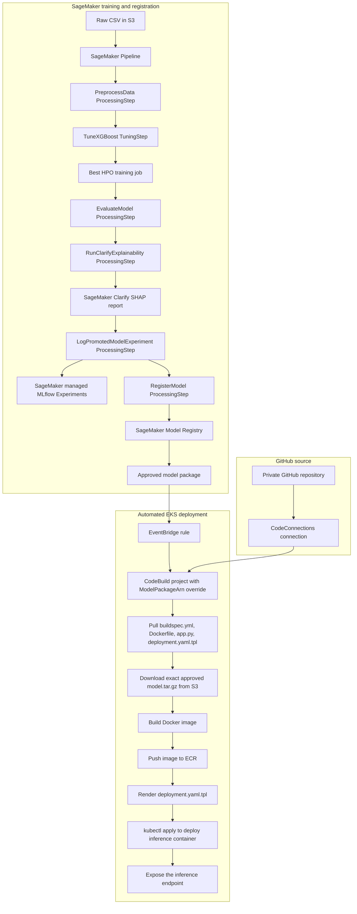

## Prerequisites

Before running the workflow, make sure these pieces exist.

| Requirement                              | Why it is needed                                                                                                                                                                                                                                                            |
| ---------------------------------------- | --------------------------------------------------------------------------------------------------------------------------------------------------------------------------------------------------------------------------------------------------------------------------- |
| AWS CLI authenticated to the account     | Used to create IAM roles, upload data to S3, inspect SageMaker, create EventBridge rules, and start CodeBuild.                                                                                                                                                              |
| SageMaker execution role                 | `pipeline.py` calls `get_execution_role()` and uses that role for processing, tuning, evaluation, Clarify explainability, Experiments tracking, and registration jobs. Run it from SageMaker Studio or another SageMaker environment where the execution role is available. |
| Raw training CSV in S3                   | The pipeline reads the input CSV from `DATA_S3_URI`; it does not read the local CSV directly. The S3 bucket must already exist.                                                                                                                                             |
| SageMaker managed MLflow tracking server | Needed if you want runs to appear in the current Studio Experiments UI. The SageMaker execution role must be allowed to access the tracking server and write to its artifact store.                                                                                         |
| Existing EKS cluster                     | CodeBuild deploys the approved model-serving container to this cluster.                                                                                                                                                                                                     |
| CodeBuild access to EKS                  | The CodeBuild service role must be authorized in EKS before `kubectl apply` can work.                                                                                                                                                                                       |
| Private GitHub source access\*           | CodeBuild pulls `buildspec.yml`, `Dockerfile`, `app.py`, and `deployment.yaml.tpl` from this repo.                                                                                                                                                                          |
| ECR repository setup                     | CodeBuild pushes the model-serving image to ECR before deploying it to EKS. The setup command below creates the repository if needed.                                                                                                                                       |
| SageMaker SDK v3 client                  | The local/Studio Python environment that runs `pipeline.py` needs `sagemaker==3.15.0`.                                                                                                                                                                                      |

_GitHub is optional. Adjust the CodeBuild project configuration to meet your requirements._

## IAM Roles Used

This project uses three IAM roles and one EKS authorization mapping. Code in the README creates the two deployment automation roles; the SageMaker execution role is a prerequisite.

| Role or mapping                        | Created in this README?              | Purpose                                                                                                                                                                                                                                                      |
| -------------------------------------- | ------------------------------------ | ------------------------------------------------------------------------------------------------------------------------------------------------------------------------------------------------------------------------------------------------------------ |
| SageMaker execution role               | No                                   | Used by `pipeline.py` for SageMaker processing, automatic model tuning, Clarify explainability, MLflow/classic Experiments tracking, and model registration. This comes from the SageMaker Studio or notebook environment where `get_execution_role()` runs. |
| `CodeBuildServiceRole`                 | Yes                                  | Used by CodeBuild to read the approved model artifact from S3, read SageMaker Model Registry metadata, push the image to ECR, use the GitHub CodeConnections source credential, describe the EKS cluster, and write CloudWatch Logs.                         |
| EKS access entry or `aws-auth` mapping | Yes, as a cluster authorization step | Authorizes `CodeBuildServiceRole` inside the Kubernetes cluster so `kubectl apply` and rollout commands can run. This is not a separate IAM role.                                                                                                            |
| `EventBridgeCodeBuildRole`             | Yes                                  | Used by EventBridge to call `codebuild:StartBuild` when a SageMaker model package changes to `Approved`.                                                                                                                                                     |

The AWS identity running these setup commands also needs permission to create IAM roles and policies, pass roles to AWS services, create EventBridge rules and targets, configure EKS access, create or inspect ECR repositories, and upload the dataset to S3.

## Environment

Replace these values for your account.

```bash
export AWS_ACCOUNT_ID=123456789012
export AWS_DEFAULT_REGION=us-east-1
export EKS_CLUSTER_NAME=my-eks-cluster
export EKS_NAMESPACE=ml-inference
export IMAGE_REPO_NAME=demo-xgboost-reg-service
export MODEL_PACKAGE_GROUP=xgboost-regression-models
export CODEBUILD_PROJECT_NAME=xgboost-eks-deploy
export CODEBUILD_SERVICE_ROLE_NAME=CodeBuildServiceRole
export DATA_S3_URI=s3://my-sagemaker-bucket/path/to/abalone.csv
export EXPERIMENT_NAME=xgboost-eks-experiments
export MLFLOW_TRACKING_SERVER_NAME=ml-flow-tracking-demo
export MAX_TUNING_JOBS=8
export MAX_PARALLEL_TUNING_JOBS=2
```

Verify the MLflow tracking server name if you want runs to appear in the current Studio Experiments UI:

```bash
aws sagemaker describe-mlflow-tracking-server \
  --tracking-server-name "$MLFLOW_TRACKING_SERVER_NAME" \
  --query TrackingServerArn \
  --output text \
  --region "$AWS_DEFAULT_REGION"
```

Install [SageMaker Python SDK v3.0](https://sagemaker.readthedocs.io/en/stable/) where you run `pipeline.py`.

```bash
python3 -m pip install --upgrade pip
python3 -m pip install "sagemaker==3.15.0"
```

## Trigger The SageMaker Training Pipeline

This command is the manual trigger for the SageMaker training pipeline. It creates or updates the pipeline definition, starts a new pipeline execution, tunes candidate XGBoost models, evaluates the best model, runs SageMaker Clarify SHAP explainability, logs the promoted model summary in SageMaker managed MLflow Experiments, and registers the resulting model package.

New SageMaker Studio shows MLflow-backed Experiments. Pass the tracking server name shown in Studio so `pipeline.py` can resolve the tracking server ARN before starting the run. If you omit the MLflow option, the pipeline still writes `experiment_summary.json` to S3 and records classic SageMaker Experiments API objects, but those may not appear in the current Studio Experiments page.

Run the pipeline from the project directory:

```bash
cd /path/to/project

python3 -B ./pipeline.py --submit \
  --input-data "$DATA_S3_URI" \
  --target-column Rings \
  --model-approval-status Approved \
  --experiment-name "$EXPERIMENT_NAME" \
  --mlflow-tracking-server-name "$MLFLOW_TRACKING_SERVER_NAME" \
  --max-tuning-jobs "$MAX_TUNING_JOBS" \
  --max-parallel-tuning-jobs "$MAX_PARALLEL_TUNING_JOBS" \
  --wait
```

The MLflow logging step installs `mlflow` and `sagemaker-mlflow` inside the processing container before importing `boto3` if those packages are not already available. It logs metrics, parameters, and tags to MLflow; artifact upload is best-effort so a transient artifact-client issue does not fail the whole pipeline. If your processing jobs run in a VPC without outbound package access, use `--submit` without the MLflow tracking server option or bake those packages into a custom processing image before enabling MLflow logging.

After the run completes, open Studio, go to Experiments, select the MLflow tracking server, and open the `$EXPERIMENT_NAME` experiment.

Keep the checked-in `code/` directory next to `pipeline.py`. The pipeline references `code/preprocess.py`, `code/evaluate.py`, `code/run_clarify.py`, `code/log_experiment.py`, and `code/register_model.py` when it builds the SageMaker processing steps.

The pipeline stages are:

| Step                         | What it does                                                                                                                                                               |
| ---------------------------- | -------------------------------------------------------------------------------------------------------------------------------------------------------------------------- |
| `PreprocessData`             | Reads the CSV from S3, one-hot encodes categorical fields, and creates train/validation/test splits.                                                                       |
| `TuneXGBoost`                | Runs SageMaker Automatic Model Tuning and selects the best candidate by validation RMSE.                                                                                   |
| `EvaluateModel`              | Calculates RMSE and R2 for the best HPO model against the test split.                                                                                                      |
| `RunClarifyExplainability`   | Launches SageMaker Clarify for SHAP explainability against the best HPO model.                                                                                             |
| `LogPromotedModelExperiment` | Records the promoted model artifact, tuning job, Clarify report, best training job, and metrics in SageMaker managed MLflow Experiments, S3, and classic Experiments APIs. |
| `RegisterModel`              | Creates a model package in `xgboost-regression-models` using the best HPO model artifact and attaches model quality plus explainability metadata.                          |

The Clarify step creates a temporary SageMaker model and launches a SageMaker Clarify processing job. The SageMaker execution role therefore needs permission to create/delete SageMaker models, create/describe processing jobs, pass itself to SageMaker, read the model/data from S3, and write Clarify reports to S3.

The pipeline intentionally does not use SDK v3 remote-function steps. The XGBoost container reports Python 3.9, while many Studio/local kernels are Python 3.12. Remote-function steps require those versions to match.

## Find The Registered Model

```bash
aws sagemaker list-model-packages \
  --model-package-group-name $MODEL_PACKAGE_GROUP \
  --sort-by CreationTime \
  --sort-order Descending \
  --max-results 5 \
  --region $AWS_DEFAULT_REGION
```

Get the latest package ARN:

```bash
MODEL_PACKAGE_ARN=$(aws sagemaker list-model-packages \
  --model-package-group-name $MODEL_PACKAGE_GROUP \
  --sort-by CreationTime \
  --sort-order Descending \
  --max-results 1 \
  --query 'ModelPackageSummaryList[0].ModelPackageArn' \
  --output text \
  --region $AWS_DEFAULT_REGION)

echo "$MODEL_PACKAGE_ARN"
```

Optionally, approve a pending package manually:

```bash
aws sagemaker update-model-package \
  --model-package-arn "$MODEL_PACKAGE_ARN" \
  --model-approval-status Approved \
  --region $AWS_DEFAULT_REGION
```

## Create CodeBuild Role

The policy files already exist in this project.

```bash
aws iam create-role \
  --role-name $CODEBUILD_SERVICE_ROLE_NAME \
  --assume-role-policy-document file://codebuild-trust-policy.json

aws iam put-role-policy \
  --role-name $CODEBUILD_SERVICE_ROLE_NAME \
  --policy-name CodeBuildXGBoostEksDeployPolicy \
  --policy-document file://codebuild-service-policy.json

export CODEBUILD_SERVICE_ROLE_ARN=$(aws iam get-role \
  --role-name $CODEBUILD_SERVICE_ROLE_NAME \
  --query 'Role.Arn' \
  --output text)

echo "$CODEBUILD_SERVICE_ROLE_ARN"
aws iam get-role --role-name $CODEBUILD_SERVICE_ROLE_NAME --query 'Role.AssumeRolePolicyDocument'

# IAM role changes can take a few seconds to propagate before CodeBuild accepts the role.
sleep 15
```

## Create ECR Repository

Create the ECR repository once if it does not exist:

```bash
aws ecr describe-repositories \
  --repository-names $IMAGE_REPO_NAME \
  --region $AWS_DEFAULT_REGION >/dev/null 2>&1 || \
aws ecr create-repository \
  --repository-name $IMAGE_REPO_NAME \
  --region $AWS_DEFAULT_REGION
```

## Create CodeBuild Project

Create the CodeBuild project once. `buildspec.yml` is the recipe CodeBuild uses every time the job runs.

Use the GitHub repository as the CodeBuild source so there is no recurring zip/upload step.

This is the final working source setup:

Create or edit the CodeBuild project in the AWS Console:

```text
Project name: xgboost-eks-deploy
Source provider: GitHub
Credential: CodeBuild managed OAuth token
Use override credentials for this project only: checked
Connection: arn:aws:codeconnections:us-east-1:123456789012:connection/xxxxxxxx-xxxx-xxxx-xxxx-xxxxxxxxxxxx
Only show secrets with tag codebuild:source: checked
Repository: Repository in my GitHub account
Repository URL: https://github.com/YOUR_GITHUB_USER/YOUR_REPOSITORY
Source version: main
Buildspec: buildspec.yml
Environment image: aws/codebuild/standard:7.0
Privileged mode: enabled
Service role: CodeBuildServiceRole
```

Important source-auth notes:

- `buildspec.yml` does not authenticate to GitHub. CodeBuild downloads the repository before it reads `buildspec.yml`.
- `DOWNLOAD_SOURCE` failures are CodeBuild source credential problems, not buildspec problems.
- The green `Your account is successfully connected through OAuth using CodeBuild managed token` message only confirms the account-level GitHub credential is connected.
- The working project-specific setting still uses the selected CodeConnections connection ARN above.
- Keep `Use override credentials for this project only` checked for this working configuration.
- After changing `buildspec.yml`, commit and push before rerunning CodeBuild. The project pulls `main` from GitHub.
- The repository field must be a valid GitHub URL (no `.git`). The working URL format is:

```text
https://github.com/YOUR_GITHUB_USER/YOUR_REPOSITORY
```

Confirm the project source configuration:

```bash
aws codebuild batch-get-projects \
  --names $CODEBUILD_PROJECT_NAME \
  --region $AWS_DEFAULT_REGION \
  --query 'projects[0].{Role:serviceRole,Source:source,SourceVersion:sourceVersion}' \
  --output json
```

When source download works, the build logs show `Phase is DOWNLOAD_SOURCE` followed by `CODEBUILD_SRC_DIR=.../src/github.com/YOUR_GITHUB_USER/YOUR_REPOSITORY`.

After a model package has been registered and approved, start a manual test build with an explicit model package ARN:

```bash
aws codebuild start-build \
  --project-name $CODEBUILD_PROJECT_NAME \
  --environment-variables-override name=MODEL_PACKAGE_ARN,value="$MODEL_PACKAGE_ARN",type=PLAINTEXT \
  --region $AWS_DEFAULT_REGION
```

Optional S3 source fallback:

```bash
export SOURCE_BUCKET=sagemaker-us-east-1-$AWS_ACCOUNT_ID
export SOURCE_KEY=codebuild/xgboost-eks-deploy-source.zip

test -f buildspec.yml && test -f deployment.yaml.tpl && test -f Dockerfile && test -f app.py
zip -r xgboost-eks-deploy-source.zip buildspec.yml deployment.yaml.tpl Dockerfile app.py
unzip -l xgboost-eks-deploy-source.zip
aws s3 cp xgboost-eks-deploy-source.zip s3://$SOURCE_BUCKET/$SOURCE_KEY
```

The S3 fallback is only for bypassing GitHub source authentication during troubleshooting. It is not the normal workflow.

## Grant CodeBuild Access To EKS

For clusters using EKS access entries:

```bash
export CODEBUILD_ROLE_ARN=arn:aws:iam::${AWS_ACCOUNT_ID}:role/${CODEBUILD_SERVICE_ROLE_NAME}

aws eks create-access-entry \
  --cluster-name $EKS_CLUSTER_NAME \
  --principal-arn $CODEBUILD_ROLE_ARN \
  --type STANDARD \
  --region $AWS_DEFAULT_REGION

aws eks associate-access-policy \
  --cluster-name $EKS_CLUSTER_NAME \
  --principal-arn $CODEBUILD_ROLE_ARN \
  --policy-arn arn:aws:eks::aws:cluster-access-policy/AmazonEKSClusterAdminPolicy \
  --access-scope type=cluster \
  --region $AWS_DEFAULT_REGION
```

If your cluster uses the legacy `aws-auth` ConfigMap:

```bash
eksctl create iamidentitymapping \
  --cluster $EKS_CLUSTER_NAME \
  --region $AWS_DEFAULT_REGION \
  --arn arn:aws:iam::${AWS_ACCOUNT_ID}:role/${CODEBUILD_SERVICE_ROLE_NAME} \
  --group system:masters \
  --username codebuild-deployer
```

## Create EventBridge Trigger

The rule pattern is in `eventbridge-rule.json`.

```bash
export EVENTBRIDGE_CODEBUILD_ROLE_NAME=EventBridgeCodeBuildRole

aws iam create-role \
  --role-name $EVENTBRIDGE_CODEBUILD_ROLE_NAME \
  --assume-role-policy-document file://eventbridge-codebuild-trust-policy.json

aws iam put-role-policy \
  --role-name $EVENTBRIDGE_CODEBUILD_ROLE_NAME \
  --policy-name EventBridgeStartCodeBuildPolicy \
  --policy-document "{
    \"Version\": \"2012-10-17\",
    \"Statement\": [
      {
        \"Effect\": \"Allow\",
        \"Action\": \"codebuild:StartBuild\",
        \"Resource\": \"arn:aws:codebuild:${AWS_DEFAULT_REGION}:${AWS_ACCOUNT_ID}:project/${CODEBUILD_PROJECT_NAME}\"
      }
    ]
  }"

aws events put-rule \
  --name model-approved-trigger \
  --event-pattern file://eventbridge-rule.json \
  --state ENABLED \
  --region $AWS_DEFAULT_REGION

cat > /tmp/model-approved-targets.json <<EOF
[
  {
    "Id": "codebuild-deploy",
    "Arn": "arn:aws:codebuild:${AWS_DEFAULT_REGION}:${AWS_ACCOUNT_ID}:project/${CODEBUILD_PROJECT_NAME}",
    "RoleArn": "arn:aws:iam::${AWS_ACCOUNT_ID}:role/${EVENTBRIDGE_CODEBUILD_ROLE_NAME}",
    "InputTransformer": {
      "InputPathsMap": {
        "modelPackageArn": "$.resources[0]"
      },
      "InputTemplate": "{\"environmentVariablesOverride\":[{\"name\":\"MODEL_PACKAGE_ARN\",\"value\":<modelPackageArn>,\"type\":\"PLAINTEXT\"}]}"
    }
  }
]
EOF

aws events put-targets \
  --rule model-approved-trigger \
  --targets file:///tmp/model-approved-targets.json \
  --region $AWS_DEFAULT_REGION
```

The input transformer copies the approved model package ARN from `$.resources[0]` into the CodeBuild environment variable `MODEL_PACKAGE_ARN`. CodeBuild then deploys that exact package. Builds fail fast if `MODEL_PACKAGE_ARN` is missing.

Do not test this by spoofing `Source=aws.sagemaker` with `aws events put-events`; EventBridge rejects that source. Test by changing a real model package from `PendingManualApproval` to `Approved`.

## Run A Deployment Manually

```bash
aws codebuild start-build \
  --project-name $CODEBUILD_PROJECT_NAME \
  --environment-variables-override name=MODEL_PACKAGE_ARN,value="$MODEL_PACKAGE_ARN",type=PLAINTEXT \
  --region $AWS_DEFAULT_REGION
```

Check recent builds:

```bash
aws codebuild list-builds-for-project \
  --project-name $CODEBUILD_PROJECT_NAME \
  --sort-order DESCENDING \
  --region $AWS_DEFAULT_REGION \
  --max-items 5
```

## Test Inference

Make sure you use the right namespace.

```bash
kubectl get deployment demo-xgboost-reg-service -n $EKS_NAMESPACE \
  -o jsonpath='{.spec.template.spec.containers[0].image}{"\n"}'

kubectl rollout status deployment/demo-xgboost-reg-service -n $EKS_NAMESPACE
kubectl port-forward svc/demo-xgboost-reg-service 8080:80 -n $EKS_NAMESPACE
```

In another terminal:

```bash
curl -s http://127.0.0.1:8080/health

curl -s -X POST http://127.0.0.1:8080/predict \
  -H "Content-Type: text/csv" \
  --data '0.455,0.365,0.095,0.514,0.2245,0.101,0.15,0,0,1,0'
```

Expected shape:

```json
{ "predictions": [8.720662117004395] }
```

## Troubleshooting

If `aws codebuild create-project` returns `Invalid service role`, verify the role exists, the ARN is not empty, and the trust policy allows CodeBuild:

```bash
echo "$CODEBUILD_SERVICE_ROLE_ARN"

aws iam get-role \
  --role-name $CODEBUILD_SERVICE_ROLE_NAME \
  --query 'Role.[Arn,AssumeRolePolicyDocument]' \
  --output json
```

The trust policy must include `"Service": "codebuild.amazonaws.com"`. If the role was just created or updated, wait 15-30 seconds and retry `create-project`.

If a build fails during `DOWNLOAD_SOURCE` with `Failed to get access token` or `authentication required for primary source`, fix the CodeBuild project source settings in the console. For this demo, the working path is GitHub with **Use override credentials for this project only** checked and this connection selected:

```text
arn:aws:codeconnections:us-east-1:123456789012:connection/xxxxxxxx-xxxx-xxxx-xxxx-xxxxxxxxxxxx
```

Also re-attach `codebuild-service-policy.json` to `CodeBuildServiceRole` so the role can use that connection.

If a build fails with `YAML_FILE_ERROR: Expected Commands[...] to be of string type`, inspect `buildspec.yml` for an unquoted command containing a colon. YAML can parse a command such as `echo "Image tag: $IMAGE_TAG"` as a mapping unless the whole command is quoted:

```yaml
- 'echo "Image tag: $IMAGE_TAG"'
```

Validate that every buildspec command is a string:

```bash
ruby -e 'require "yaml"; y=YAML.load_file("buildspec.yml"); y.fetch("phases").each { |phase, body| Array(body["commands"]).each_with_index { |cmd, i| abort "#{phase} command #{i} is #{cmd.class}: #{cmd.inspect}" unless cmd.is_a?(String) } }; puts "buildspec command strings OK"'
```

If CodeBuild cannot create CloudWatch log streams, re-attach `codebuild-service-policy.json` to `CodeBuildServiceRole`.

If CodeBuild says `You must be logged in to the server`, the IAM role can describe the EKS cluster but is not authorized inside Kubernetes. Complete the EKS access-entry or `aws-auth` mapping above.

If inference fails locally, verify the namespace on your port-forward command. The service is expected in `ml-inference`, not `default`.

If the pipeline appears to run old code, run from this project directory and use `python3 -B ./pipeline.py` to avoid stale bytecode.

## Rollback

```bash
kubectl rollout history deployment/demo-xgboost-reg-service -n $EKS_NAMESPACE
kubectl rollout undo deployment/demo-xgboost-reg-service -n $EKS_NAMESPACE
kubectl rollout undo deployment/demo-xgboost-reg-service -n $EKS_NAMESPACE --to-revision=3
```

### Previews

Amazon SageMaker AI Pipelines

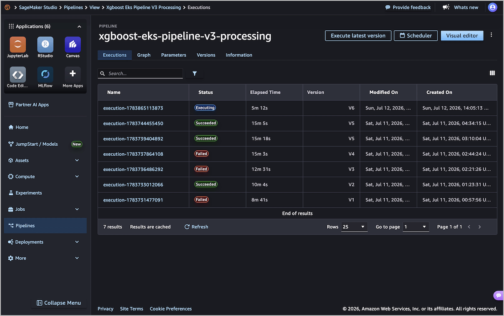

Amazon SageMaker AI Pipelines

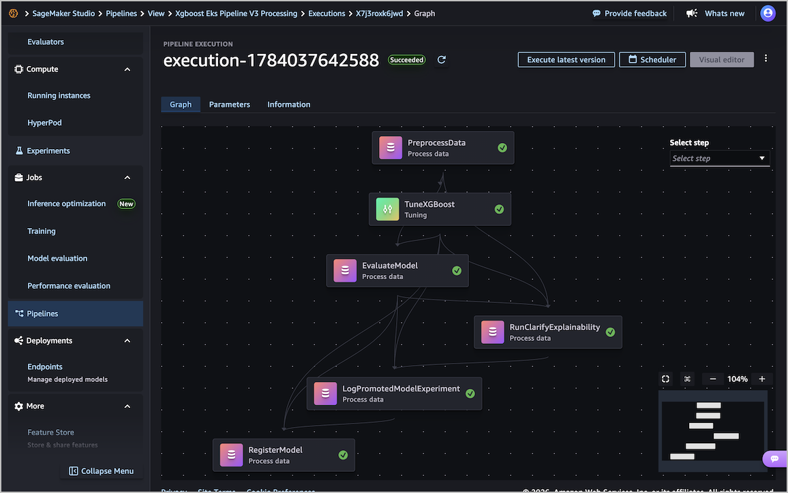

Amazon SageMaker AI Training And Tuning Jobs

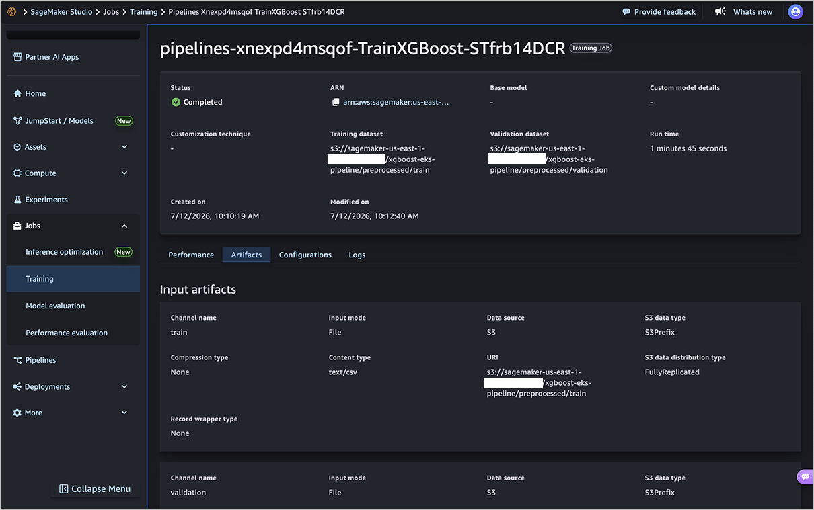

Amazon SageMaker Clarify Explainability

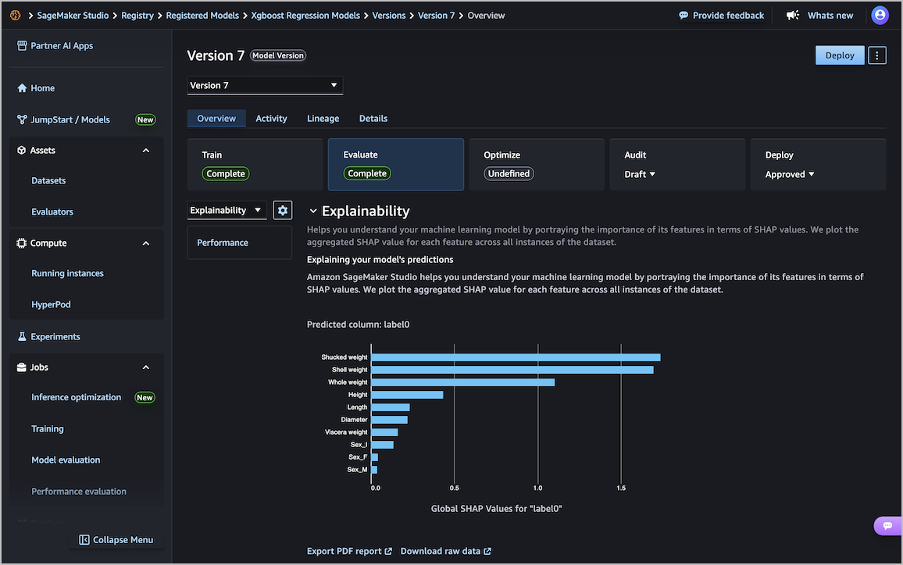

SageMaker Clarify S3 assets

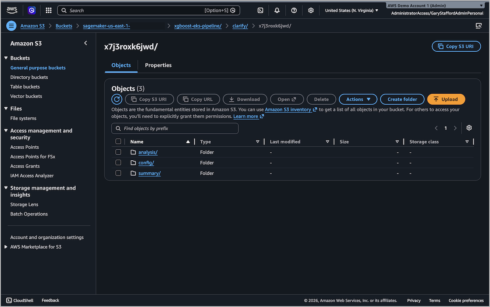

SageMaker managed MLflow Experiments

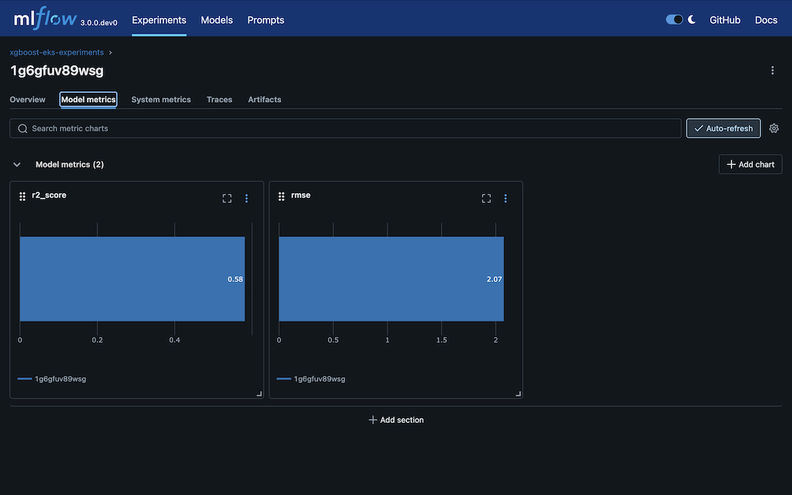

Amazon SageMaker AI Model Registry

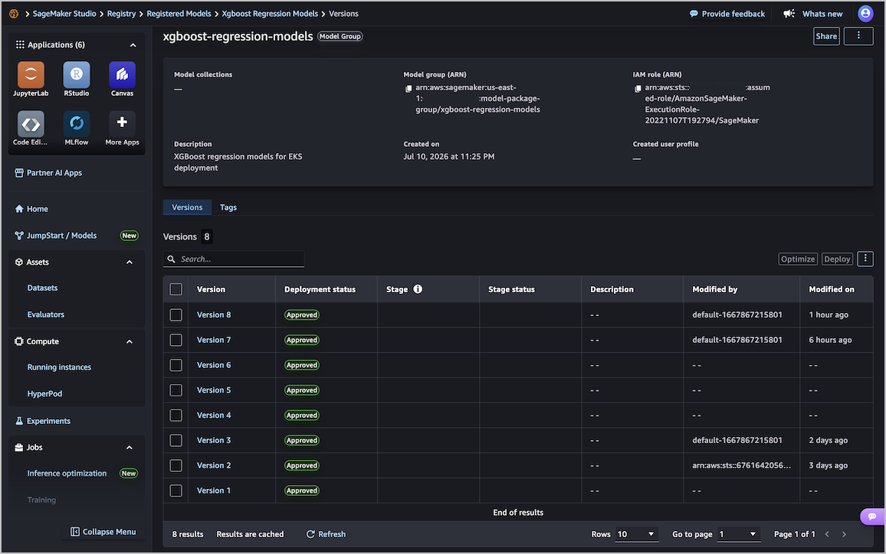

Amazon SageMaker AI Model Registry

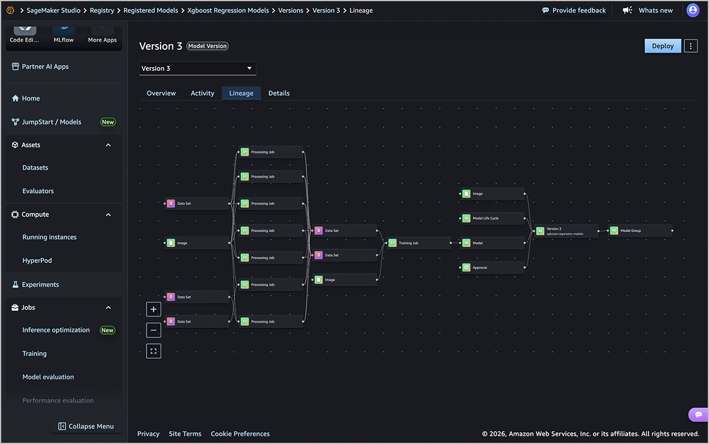

Amazon EventBridge

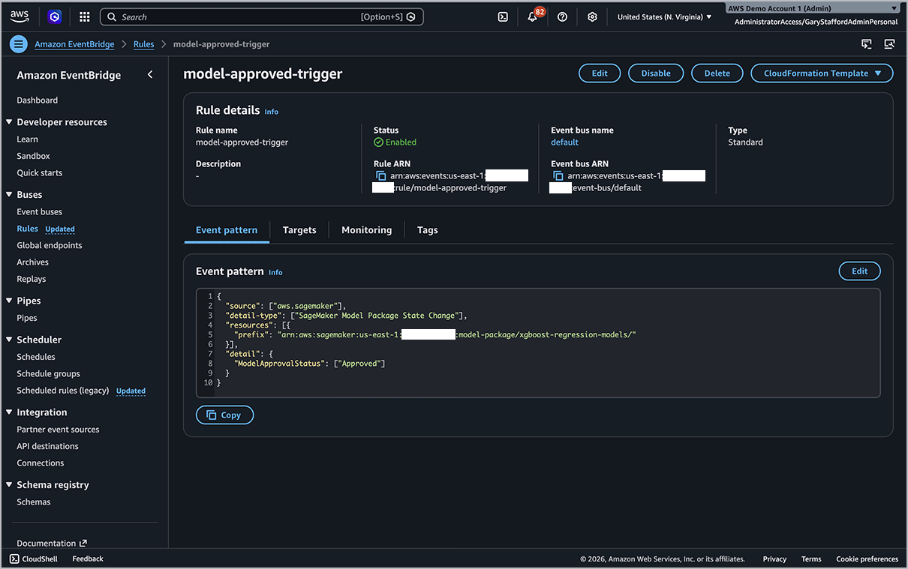

AWS CodeBuild

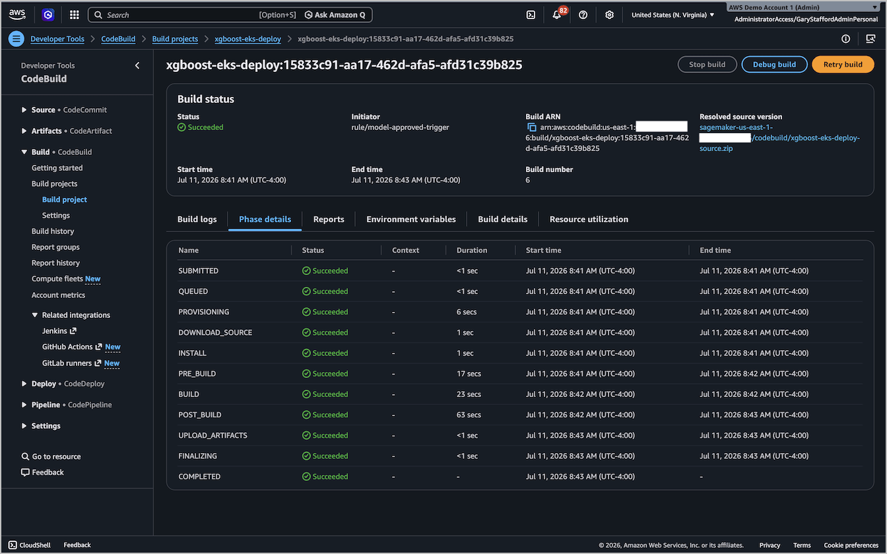

CodeBuild model package ARN logs

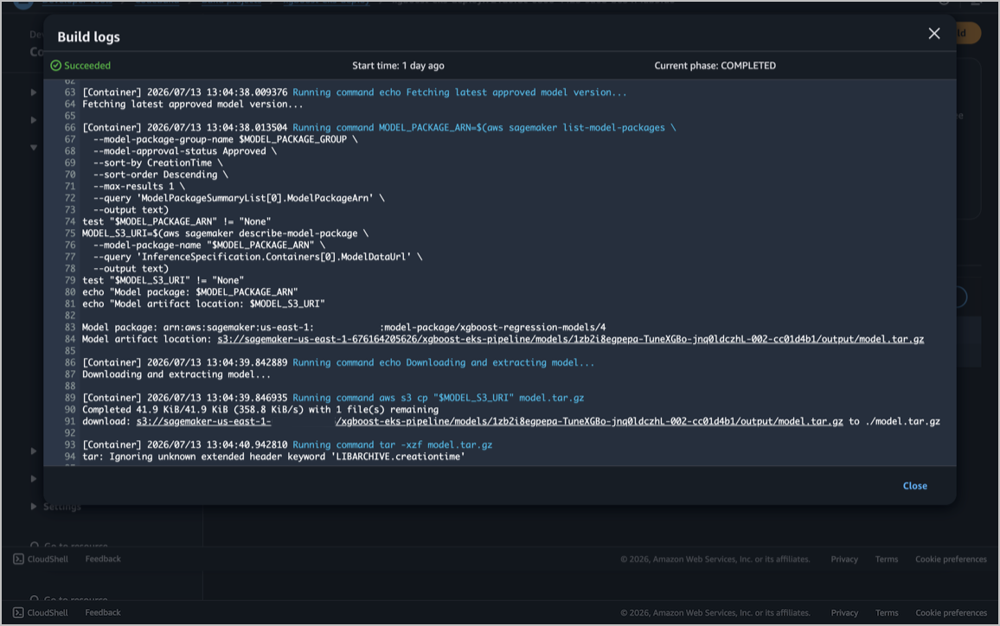

Amazon Elastic Container Registry (Amazon ECR)

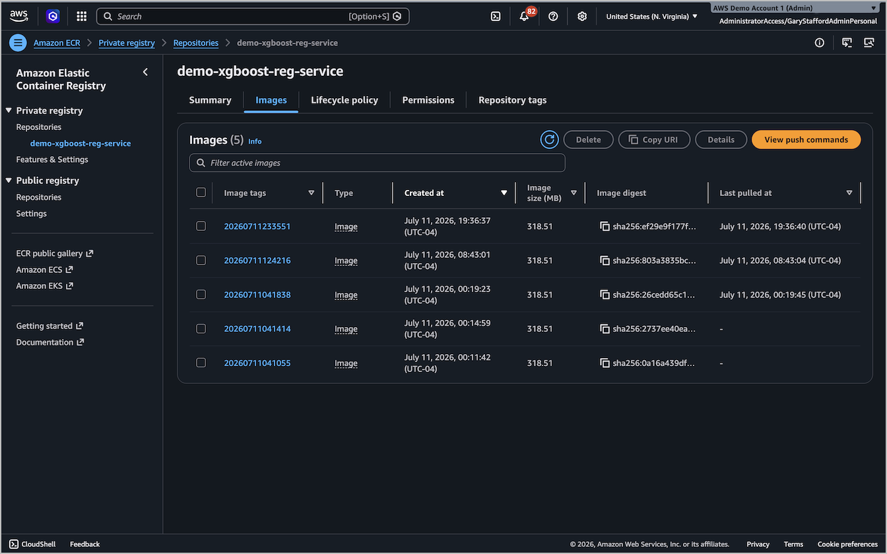

Amazon Elastic Kubernetes Service (Amazon EKS)

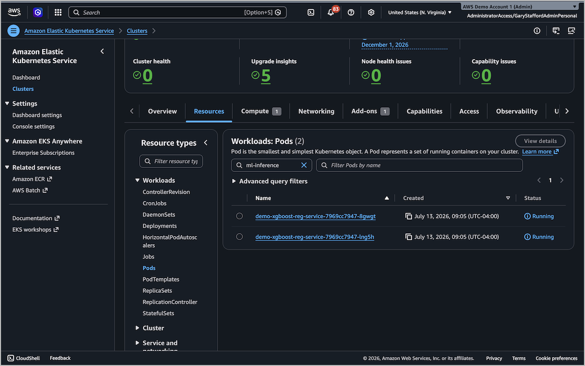

Model Inference

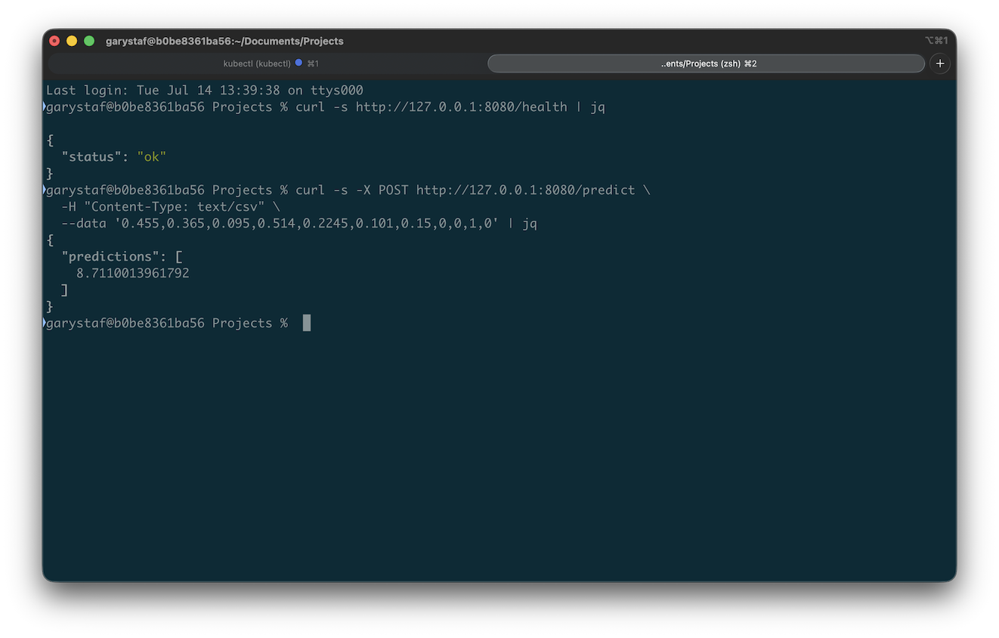

## References

Here are a few useful references:

- [Amazon SageMaker AI Pipelines](https://docs.aws.amazon.com/sagemaker/latest/dg/pipelines.html)
- [SageMaker Python SDK V3](https://sagemaker.readthedocs.io/en/stable/index.html)
- [SageMaker Python SDK on GitHub](https://github.com/aws/sagemaker-python-sdk)
- [Overview of AI and ML on Amazon EKS](https://docs.aws.amazon.com/eks/latest/userguide/ml-on-eks.html)

## License

This project is licensed under the MIT License. See the [LICENSE](LICENSE) file for details.

## Disclaimer

The contents of this repository represent my viewpoints and not those of my past or current employers, including Amazon Web Services (AWS). All third-party libraries, modules, plugins, and SDKs are the property of their respective owners.
