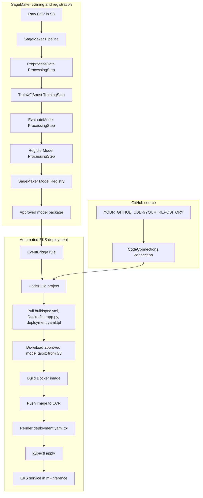

# End-to-End ML Workflow from SageMaker Training to EKS Deployment

This project demonstrates how MLOps and DevOps practices work together to deliver a trained machine learning model into production. The MLOps workflow uses Amazon SageMaker Pipelines to train an XGBoost regression model and register it in SageMaker Model Registry. After the model is approved, the DevOps workflow uses AWS CodeBuild and Amazon ECR to package and deploy the model-serving application to Amazon EKS. Amazon EventBridge connects the two workflows, creating a continuous path from model approval to Kubernetes deployment.

## Files

| File                                      | Purpose                                                                  |
| ----------------------------------------- | ------------------------------------------------------------------------ |
| `pipeline.py`                             | SageMaker SDK v3 pipeline definition and CLI entrypoint.                 |
| `app.py`                                  | FastAPI inference service loaded into the Docker image.                  |
| `Dockerfile`                              | Builds the inference container.                                          |
| `buildspec.yml`                           | CodeBuild recipe. CodeBuild reads this every deployment run.             |
| `deployment.yaml.tpl`                     | Kubernetes deployment/service template rendered by CodeBuild.            |
| `codebuild-trust-policy.json`             | IAM trust policy for the CodeBuild service role.                         |
| `codebuild-service-policy.json`           | IAM permissions policy for CodeBuild.                                    |
| `eventbridge-codebuild-trust-policy.json` | IAM trust policy for EventBridge to start CodeBuild.                     |
| `eventbridge-rule.json`                   | EventBridge rule pattern for approved SageMaker model packages.          |
| `abalone.csv`                             | Local copy of the sample dataset. Pipeline input should use the S3 copy. |

## Architecture



## Environment

Replace these values for your account.

```bash
export AWS_ACCOUNT_ID=123456789012
export AWS_DEFAULT_REGION=us-east-1
export EKS_CLUSTER_NAME=my-eks-cluster
export EKS_NAMESPACE=ml-inference
export IMAGE_REPO_NAME=demo-xgboost-reg-service
export MODEL_PACKAGE_GROUP=xgboost-regression-models
export CODEBUILD_PROJECT_NAME=xgboost-eks-deploy
export CODEBUILD_SERVICE_ROLE_NAME=CodeBuildServiceRole
export DATA_S3_URI=s3://my-sagemaker-bucket/path/to/abalone.csv
```

Install the SageMaker SDK v3 client where you run `pipeline.py`.

```bash
python3 -m pip install --upgrade pip
python3 -m pip install "sagemaker==3.15.0"
```

## Run The SageMaker Pipeline

Run from the project directory:

```bash
cd /path/to/xgboost-demo-public
rm -rf __pycache__ .ipynb_checkpoints

python3 -B ./pipeline.py --submit \
  --input-data $DATA_S3_URI \
  --target-column Rings \
  --model-approval-status Approved \
  --wait
```

The pipeline stages are:

| Step             | What it does                                                                                         |
| ---------------- | ---------------------------------------------------------------------------------------------------- |
| `PreprocessData` | Reads the CSV from S3, one-hot encodes categorical fields, and creates train/validation/test splits. |
| `TrainXGBoost`   | Trains with the SageMaker XGBoost image.                                                             |
| `EvaluateModel`  | Calculates RMSE and R2 against the test split.                                                       |
| `RegisterModel`  | Creates a model package in `xgboost-regression-models`.                                              |

The pipeline intentionally does not use SDK v3 remote-function steps. The XGBoost container reports Python 3.9, while many Studio/local kernels are Python 3.12. Remote-function steps require those versions to match.

## Find The Registered Model

```bash
aws sagemaker list-model-packages \
  --model-package-group-name $MODEL_PACKAGE_GROUP \
  --sort-by CreationTime \
  --sort-order Descending \
  --max-results 5 \
  --region $AWS_DEFAULT_REGION
```

Get the latest package ARN:

```bash
MODEL_PACKAGE_ARN=$(aws sagemaker list-model-packages \
  --model-package-group-name $MODEL_PACKAGE_GROUP \
  --sort-by CreationTime \
  --sort-order Descending \
  --max-results 1 \
  --query 'ModelPackageSummaryList[0].ModelPackageArn' \
  --output text \
  --region $AWS_DEFAULT_REGION)

echo "$MODEL_PACKAGE_ARN"
```

Approve a pending package manually:

```bash
aws sagemaker update-model-package \
  --model-package-arn "$MODEL_PACKAGE_ARN" \
  --model-approval-status Approved \
  --region $AWS_DEFAULT_REGION
```

## Create CodeBuild Role

The policy files already exist in this project.

```bash
aws iam create-role \
  --role-name $CODEBUILD_SERVICE_ROLE_NAME \
  --assume-role-policy-document file://codebuild-trust-policy.json

aws iam put-role-policy \
  --role-name $CODEBUILD_SERVICE_ROLE_NAME \
  --policy-name CodeBuildXGBoostEksDeployPolicy \
  --policy-document file://codebuild-service-policy.json

export CODEBUILD_SERVICE_ROLE_ARN=$(aws iam get-role \
  --role-name $CODEBUILD_SERVICE_ROLE_NAME \
  --query 'Role.Arn' \
  --output text)

echo "$CODEBUILD_SERVICE_ROLE_ARN"
aws iam get-role --role-name $CODEBUILD_SERVICE_ROLE_NAME --query 'Role.AssumeRolePolicyDocument'

# IAM role changes can take a few seconds to propagate before CodeBuild accepts the role.
sleep 15
```

## Create CodeBuild Project

Create the CodeBuild project once. `buildspec.yml` is the recipe CodeBuild uses every time the job runs.

Use the GitHub repository as the CodeBuild source so there is no recurring zip/upload step.

This is the final working source setup:

Create or edit the CodeBuild project in the AWS Console:

```text
Project name: xgboost-eks-deploy
Source provider: GitHub
Credential: CodeBuild managed OAuth token
Use override credentials for this project only: checked
Connection: arn:aws:codeconnections:us-east-1:123456789012:connection/xxxxxxxx-xxxx-xxxx-xxxx-xxxxxxxxxxxx
Only show secrets with tag codebuild:source: checked
Repository: Repository in my GitHub account
Repository URL: https://github.com/YOUR_GITHUB_USER/YOUR_REPOSITORY
Source version: main
Buildspec: buildspec.yml
Environment image: aws/codebuild/standard:7.0
Privileged mode: enabled
Service role: CodeBuildServiceRole
```

Important source-auth notes:

- `buildspec.yml` does not authenticate to GitHub. CodeBuild downloads the repository before it reads `buildspec.yml`.
- `DOWNLOAD_SOURCE` failures are CodeBuild source credential problems, not buildspec problems.
- The green `Your account is successfully connected through OAuth using CodeBuild managed token` message only confirms the account-level GitHub credential is connected.
- The working project-specific setting still uses the selected CodeConnections connection ARN above.
- Keep `Use override credentials for this project only` checked for this working configuration.
- After changing `buildspec.yml`, commit and push before rerunning CodeBuild. The project pulls `main` from GitHub.
- The repository field must be a valid GitHub URL. The working URL format is:

```text
https://github.com/YOUR_GITHUB_USER/YOUR_REPOSITORY
```

Confirm the project source configuration:

```bash
aws codebuild batch-get-projects \
  --names $CODEBUILD_PROJECT_NAME \
  --region $AWS_DEFAULT_REGION \
  --query 'projects[0].{Role:serviceRole,Source:source,SourceVersion:sourceVersion}' \
  --output json
```

When source download works, the build logs show `Phase is DOWNLOAD_SOURCE` followed by `CODEBUILD_SRC_DIR=.../src/github.com/YOUR_GITHUB_USER/YOUR_REPOSITORY`.

Create the ECR repository once if it does not exist:

```bash
aws ecr describe-repositories \
  --repository-names $IMAGE_REPO_NAME \
  --region $AWS_DEFAULT_REGION >/dev/null 2>&1 || \
aws ecr create-repository \
  --repository-name $IMAGE_REPO_NAME \
  --region $AWS_DEFAULT_REGION
```

Start a manual test build:

```bash
aws codebuild start-build \
  --project-name $CODEBUILD_PROJECT_NAME \
  --region $AWS_DEFAULT_REGION
```

Optional S3 source fallback:

```bash
export SOURCE_BUCKET=sagemaker-us-east-1-$AWS_ACCOUNT_ID
export SOURCE_KEY=codebuild/xgboost-eks-deploy-source.zip

test -f buildspec.yml && test -f deployment.yaml.tpl && test -f Dockerfile && test -f app.py
zip -r xgboost-eks-deploy-source.zip buildspec.yml deployment.yaml.tpl Dockerfile app.py
unzip -l xgboost-eks-deploy-source.zip
aws s3 cp xgboost-eks-deploy-source.zip s3://$SOURCE_BUCKET/$SOURCE_KEY
```

The S3 fallback is only for bypassing GitHub source authentication during troubleshooting. It is not the normal workflow.

## Grant CodeBuild Access To EKS

For clusters using EKS access entries:

```bash
export CODEBUILD_ROLE_ARN=arn:aws:iam::$AWS_ACCOUNT_ID:role/$CODEBUILD_SERVICE_ROLE_NAME

aws eks create-access-entry \
  --cluster-name $EKS_CLUSTER_NAME \
  --principal-arn $CODEBUILD_ROLE_ARN \
  --type STANDARD \
  --region $AWS_DEFAULT_REGION

aws eks associate-access-policy \
  --cluster-name $EKS_CLUSTER_NAME \
  --principal-arn $CODEBUILD_ROLE_ARN \
  --policy-arn arn:aws:eks::aws:cluster-access-policy/AmazonEKSClusterAdminPolicy \
  --access-scope type=cluster \
  --region $AWS_DEFAULT_REGION
```

If your cluster uses the legacy `aws-auth` ConfigMap:

```bash
eksctl create iamidentitymapping \
  --cluster $EKS_CLUSTER_NAME \
  --region $AWS_DEFAULT_REGION \
  --arn arn:aws:iam::$AWS_ACCOUNT_ID:role/$CODEBUILD_SERVICE_ROLE_NAME \
  --group system:masters \
  --username codebuild-deployer
```

## Create EventBridge Trigger

The rule pattern is in `eventbridge-rule.json`.

```bash
export EVENTBRIDGE_CODEBUILD_ROLE_NAME=EventBridgeCodeBuildRole

aws iam create-role \
  --role-name $EVENTBRIDGE_CODEBUILD_ROLE_NAME \
  --assume-role-policy-document file://eventbridge-codebuild-trust-policy.json

aws iam put-role-policy \
  --role-name $EVENTBRIDGE_CODEBUILD_ROLE_NAME \
  --policy-name EventBridgeStartCodeBuildPolicy \
  --policy-document "{
    \"Version\": \"2012-10-17\",
    \"Statement\": [
      {
        \"Effect\": \"Allow\",
        \"Action\": \"codebuild:StartBuild\",
        \"Resource\": \"arn:aws:codebuild:$AWS_DEFAULT_REGION:$AWS_ACCOUNT_ID:project/$CODEBUILD_PROJECT_NAME\"
      }
    ]
  }"

aws events put-rule \
  --name model-approved-trigger \
  --event-pattern file://eventbridge-rule.json \
  --state ENABLED \
  --region $AWS_DEFAULT_REGION

aws events put-targets \
  --rule model-approved-trigger \
  --targets "[{\"Id\":\"codebuild-deploy\",\"Arn\":\"arn:aws:codebuild:$AWS_DEFAULT_REGION:$AWS_ACCOUNT_ID:project/$CODEBUILD_PROJECT_NAME\",\"RoleArn\":\"arn:aws:iam::$AWS_ACCOUNT_ID:role/$EVENTBRIDGE_CODEBUILD_ROLE_NAME\"}]" \
  --region $AWS_DEFAULT_REGION
```

Do not test this by spoofing `Source=aws.sagemaker` with `aws events put-events`; EventBridge rejects that source. Test by changing a real model package from `PendingManualApproval` to `Approved`.

## Run A Deployment Manually

```bash
aws codebuild start-build \
  --project-name $CODEBUILD_PROJECT_NAME \
  --region $AWS_DEFAULT_REGION
```

Check recent builds:

```bash
aws codebuild list-builds-for-project \
  --project-name $CODEBUILD_PROJECT_NAME \
  --sort-order DESCENDING \
  --region $AWS_DEFAULT_REGION \
  --max-items 5
```

## Test Inference

Make sure you use the right namespace.

```bash
kubectl get deployment demo-xgboost-reg-service -n $EKS_NAMESPACE \
  -o jsonpath='{.spec.template.spec.containers[0].image}{"\n"}'

kubectl rollout status deployment/demo-xgboost-reg-service -n $EKS_NAMESPACE
kubectl port-forward svc/demo-xgboost-reg-service 8080:80 -n $EKS_NAMESPACE
```

In another terminal:

```bash
curl -s http://127.0.0.1:8080/health

curl -s -X POST http://127.0.0.1:8080/predict \
  -H "Content-Type: text/csv" \
  --data '0.455,0.365,0.095,0.514,0.2245,0.101,0.15,0,0,1,0'
```

Expected shape:

```json
{ "predictions": [8.720662117004395] }
```

## Troubleshooting

If `aws codebuild create-project` returns `Invalid service role`, verify the role exists, the ARN is not empty, and the trust policy allows CodeBuild:

```bash
echo "$CODEBUILD_SERVICE_ROLE_ARN"

aws iam get-role \
  --role-name $CODEBUILD_SERVICE_ROLE_NAME \
  --query 'Role.[Arn,AssumeRolePolicyDocument]' \
  --output json
```

The trust policy must include `"Service": "codebuild.amazonaws.com"`. If the role was just created or updated, wait 15-30 seconds and retry `create-project`.

If a build fails during `DOWNLOAD_SOURCE` with `Failed to get access token` or `authentication required for primary source`, fix the CodeBuild project source settings in the console. For this demo, the working path is GitHub with **Use override credentials for this project only** checked and this connection selected:

```text
arn:aws:codeconnections:us-east-1:123456789012:connection/xxxxxxxx-xxxx-xxxx-xxxx-xxxxxxxxxxxx
```

Also re-attach `codebuild-service-policy.json` to `CodeBuildServiceRole` so the role can use that connection.

If a build fails with `YAML_FILE_ERROR: Expected Commands[...] to be of string type`, inspect `buildspec.yml` for an unquoted command containing a colon. YAML can parse a command such as `echo "Image tag: $IMAGE_TAG"` as a mapping unless the whole command is quoted:

```yaml
- 'echo "Image tag: $IMAGE_TAG"'
```

Validate that every buildspec command is a string:

```bash
ruby -e 'require "yaml"; y=YAML.load_file("buildspec.yml"); y.fetch("phases").each { |phase, body| Array(body["commands"]).each_with_index { |cmd, i| abort "#{phase} command #{i} is #{cmd.class}: #{cmd.inspect}" unless cmd.is_a?(String) } }; puts "buildspec command strings OK"'
```

If CodeBuild cannot create CloudWatch log streams, re-attach `codebuild-service-policy.json` to `CodeBuildServiceRole`.

If CodeBuild says `You must be logged in to the server`, the IAM role can describe the EKS cluster but is not authorized inside Kubernetes. Complete the EKS access-entry or `aws-auth` mapping above.

If inference fails locally, verify the namespace on your port-forward command. The service is expected in `ml-inference`, not `default`.

If the pipeline appears to run old code, run from this project directory and use `python3 -B ./pipeline.py` to avoid stale bytecode.

## Rollback

```bash
kubectl rollout history deployment/demo-xgboost-reg-service -n $EKS_NAMESPACE
kubectl rollout undo deployment/demo-xgboost-reg-service -n $EKS_NAMESPACE
kubectl rollout undo deployment/demo-xgboost-reg-service -n $EKS_NAMESPACE --to-revision=3
```

## License

This project is licensed under the MIT License. See the [LICENSE](LICENSE) file for details.

## Disclaimer

The contents of this repository represent my viewpoints and not those of my past or current employers, including Amazon Web Services (AWS). All third-party libraries, modules, plugins, and SDKs are the property of their respective owners.
